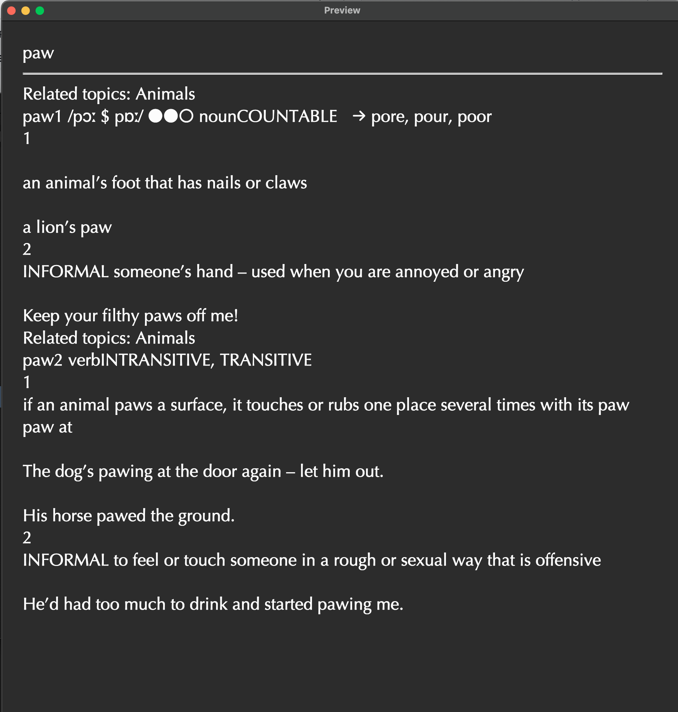
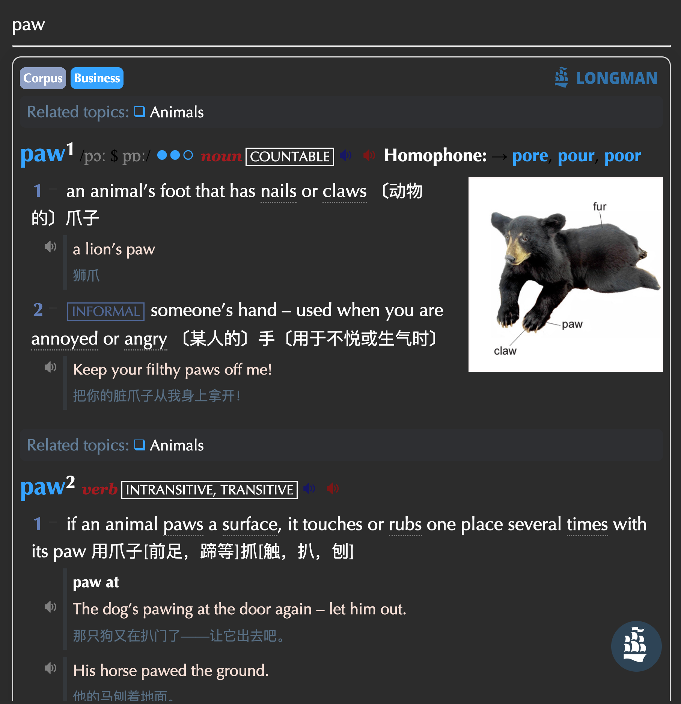

## Customizable CSS for Anki

This fork introduces the ability to customize the CSS for Anki notes sent directly from GoldenDict. It can fetch the CSS automatically or you can define your own styles for better control over how your exported content appears in Anki, providing a more personalized and flexible experience.
|Before|CSS Auto fecthed|
|--|--|
|||

# GoldenDict-ng with CSS for Anki integration

The Next Generation GoldenDict. A feature-rich open-source dictionary lookup program,
supporting [multiple dictionary formats](https://xiaoyifang.github.io/goldendict-ng/dictformats/) and online
dictionaries.

| Linux | Windows | macOS |
|--|--|--|
|  |  |  |

# Some significant features of this fork

- webengine with latest html/css feature support
- support >4GB dictionary
- support highdpi screen resolution
- built with xapian as fulltext engine
- support Qt5.15.2 and higher ,include latest Qt6
- performance optimization(eg. >10000000 headwords support) 
- anki integration
- dark theme
- daily auto release support
- lots of bug fixes and improvements

## Installation

<https://xiaoyifang.github.io/goldendict-ng/install/>

## Help GoldenDict's Development

GoldenDict is developed by volunteers.

All kinds of help like answering questions, bug reporting, testing, translation and coding are welcomed.

To translate the interface, you can use the Crowdin <https://crowdin.com/project/goldendict-ng>

To start development, check out [developer guide](https://xiaoyifang.github.io/goldendict-ng/developer/)

## Build from source

<https://xiaoyifang.github.io/goldendict-ng/howto/build_from_source/>

## Support

Bug reporting: [GoldenDict issue tracker](https://github.com/xiaoyifang/goldendict-ng/issues)

General discussions: [discussions](https://github.com/xiaoyifang/goldendict-ng/discussions)

## License

This project is licensed under the <b>GNU GPLv3+</b> license, a copy of which can be found in the `LICENSE.txt` file.

## History

The original project was developed at <http://goldendict.org/> and <https://github.com/goldendict/goldendict>.

## Thank JetBrains for the help

